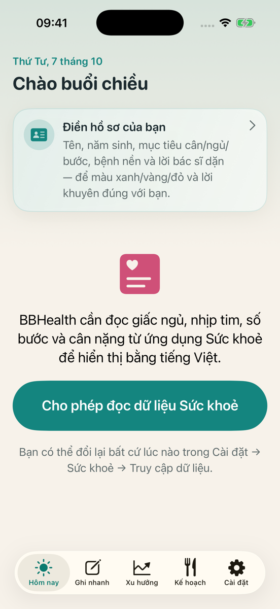
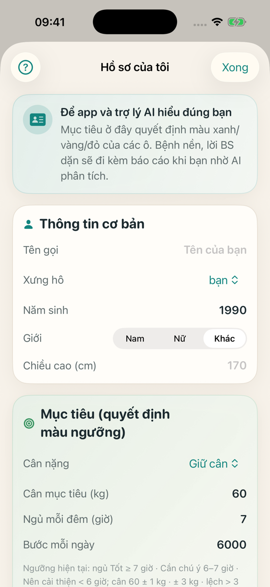
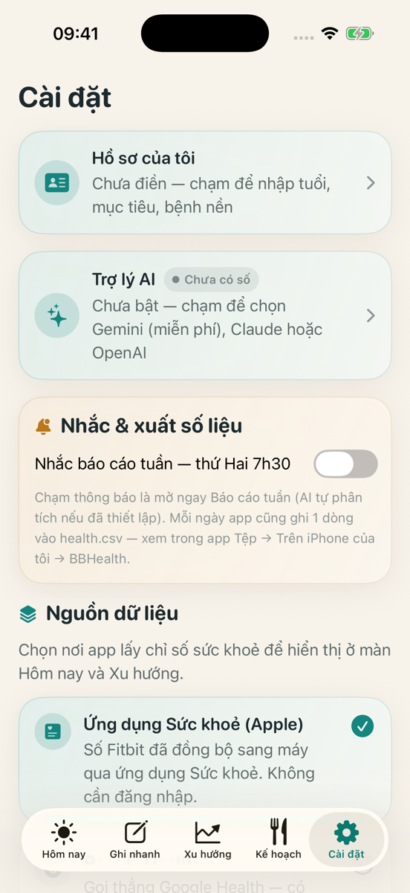

# BBHealth (f-health) — app sức khoẻ tiếng Việt cho iPhone

App iOS (SwiftUI, iOS 17+) đọc dữ liệu vòng/đồng hồ (Fitbit, Apple Watch…) qua **Apple Health** và/hoặc
**Google Health API**, rồi hiển thị bằng **tiếng Việt dễ hiểu**, tô màu **xanh/vàng/đỏ theo hồ sơ riêng**
của từng người, ghi nhanh bữa ăn/rượu bia/triệu chứng, và có **Trợ lý AI** (khoá của chính người dùng).

Không máy chủ, không tài khoản: dữ liệu ở trên máy người dùng.

> Repo này là **nguồn chung**. Mỗi người tự build **app riêng** (Team Apple + bundle id riêng) và đóng
> góp code chung qua Pull Request — xem [CONTRIBUTING.md](CONTRIBUTING.md).

## Bắt đầu nhanh (simulator, không cần tài khoản Apple)

```bash
brew install xcodegen
git clone https://github.com/mrekoj/f-health.git && cd f-health
cp Config/Local.xcconfig.example Config/Local.xcconfig   # sửa Team + bundle id khi chạy máy thật
xcodegen generate
open BBHealth.xcodeproj    # chọn simulator iPhone → Run (⌘R)
```

Trên simulator app tự dùng **dữ liệu giả** (HealthKit không có số thật trên sim). Lần đầu mở, hồ sơ trống →
màn Hôm nay có thẻ **"Điền hồ sơ của bạn"**.

Hướng dẫn đầy đủ từ máy trắng → máy thật → TestFlight:

| Tài liệu | Nội dung |
|---|---|
| [docs/SETUP.md](docs/SETUP.md) | Từng bước từ máy Mac trắng: Xcode, xcodegen, Team, bundle id, capabilities, sim, iPhone thật |
| [docs/GOOGLE-HEALTH-SETUP.md](docs/GOOGLE-HEALTH-SETUP.md) | Tạo project Google Cloud **của bạn**, OAuth client iOS, scope, test user |
| [docs/AI-SETUP.md](docs/AI-SETUP.md) | Khoá Gemini / Claude / OpenAI, AI trên iPhone, cờ debug |
| [docs/RELEASE.md](docs/RELEASE.md) | Archive → TestFlight bằng tài khoản App Store Connect **của bạn** |
| [docs/TROUBLESHOOTING.md](docs/TROUBLESHOOTING.md) | Lỗi hay gặp và cách sửa |
| [CONTRIBUTING.md](CONTRIBUTING.md) | Nhánh, PR, quy ước commit, KHÔNG commit dữ liệu riêng |
| [CLAUDE.md](CLAUDE.md) | Luật cho trợ lý code AI (Claude Code, Codex… — `AGENTS.md` trỏ về đây) |

## Ảnh màn (dữ liệu giả trên simulator, hồ sơ trống)

| Hôm nay (lần đầu) | Hồ sơ của tôi | Cài đặt |
|---|---|---|
|  |  |  |

## Tính năng

- **Hôm nay**: Ngủ · Nhịp tim nghỉ · Bước · Cân (+ HRV, nhiệt độ da khi dùng Google), sinh hiệu (nhịp thở, SpO2,
  giờ vận động, quãng đường, calo), giấc ngủ trưa tự dò, nút **?** giải thích mọi chỉ số.
- **Giấc ngủ chi tiết** (biểu đồ giai đoạn, lịch sử các đêm) · **Nhịp tim** Ngày/Tuần/Tháng, ghi chú sự kiện.
- **Nhịp tim trực tiếp qua Bluetooth** (vòng/đồng hồ có "Share heart rate" chuẩn BLE) + **thư viện 7 bài thở**.
- **Ghi nhanh** bữa ăn, rượu bia, triệu chứng, cân (ghi vào Apple Health).
- **Xu hướng** 7/30/90 ngày · **Báo cáo** ngày/tuần/tháng/90 ngày có nhận xét tự động.
- **Trợ lý AI**: phân tích báo cáo, hỏi đáp có công cụ tra số liệu, lời khuyên sáng nay — Gemini / Claude /
  OpenAI-tương-thích (khoá của người dùng) hoặc Apple Intelligence trong máy (iOS 26).
- **Xuất**: `health.csv` mỗi ngày + báo cáo `.md` vào app Tệp.

## Kiến trúc 1 trang

```
                ┌─────────────── SwiftUI Screens (Sources/BBHealth/Screens) ───────────────┐
                │ Today · Trends · Report · Plan · QuickLog · Settings · Sleep/Heart detail │
                └───────────────▲──────────────────────────────▲───────────────────────────┘
                                │ ViewModels (Model/*ViewModel) │ Thresholds ◀── HealthProfile
                                │                               │   (màu ngưỡng)   (Hồ sơ của tôi)
        ┌───────────────────────┴──────────┐        ┌───────────┴─────────────────────────┐
        │ protocol HealthStoreProvider      │        │ AI: AIClient (SSE stream + tools)    │
        │  ├ HKHealthStoreProvider (Apple)  │        │  ├ GeminiClient / ClaudeClient       │
        │  ├ GoogleHealthProvider (REST v4) │        │  ├ OpenAICompatibleClient            │
        │  │   └ GoogleAuth (OAuth PKCE,    │        │  ├ OnDeviceAIClient (FoundationModels)│
        │  │      Keychain, refresh)        │        │  └ HealthDataTools (AI tự tra số liệu)│
        │  ├ CompositeProvider (cả hai)     │        │ HealthReportBuilder → HealthReport   │
        │  └ Mock* (simulator/preview)      │        │  → HealthReportText (gói gửi AI)     │
        └───────────────────────────────────┘        └──────────────────────────────────────┘
   SwiftData: LogEntry · NapLog · HeartEvent · LiveSession · AIAnalysis · AIChatMessage
   CoreBluetooth: LiveHeartRateMonitor (BLE Heart Rate 0x180D)
```

- **Không có widget trong `main`** (đang ở nhánh riêng, cần App Group — xem SETUP mục Capabilities).
- Cấu hình riêng từng người nằm ngoài git: `Config/Local.xcconfig` (Team, bundle id, tên app, Google Client ID)
  và `Resources/Private/OwnerProfile.json` (hồ sơ sức khoẻ mặc định — tuỳ chọn).

## Cấu trúc thư mục

```
project.yml                 # xcodegen → BBHealth.xcodeproj (không commit .xcodeproj)
Config/
  Base.xcconfig             # mặc định chung (commit)
  Local.xcconfig.example    # mẫu → copy thành Local.xcconfig (gitignore)
Resources/
  Info.plist, BBHealth.entitlements   # xcodegen sinh từ project.yml
  Assets.xcassets
  Private/                  # gitignore — OwnerProfile.json (mẫu: OwnerProfile.example.json)
Sources/BBHealth/
  App/            # BBHealthApp, DebugOptions (cờ chạy thử -BBH…)
  Screens/        # các màn hình
  Components/     # thẻ, sheet dùng lại
  DesignSystem/   # Theme, màu, khoảng cách
  Model/          # HealthProfile, Thresholds, Explanations, MealPlan, BreathingPatterns, Report, AI settings…
  Health/         # provider Apple/Google/Mock, GoogleAuth, AIClient, NapDetector, Bluetooth, xuất file
scripts/          # release-testflight.sh + client App Store Connect API (Python)
web/              # MẪU trang giới thiệu + privacy (cần cho TestFlight external)
docs/             # tài liệu (bảng ở trên)
```

## Lưu ý y tế

App chỉ để **tham khảo lối sống**, không chẩn đoán, **không thay bác sĩ**. Ngưỡng màu là mục tiêu cá nhân
người dùng tự đặt, không phải chuẩn y khoa.
